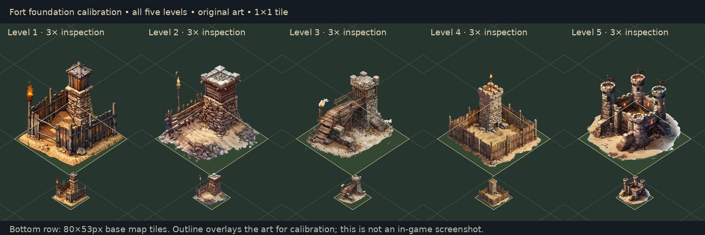

# Personal fort alignment (levels 1–5)

Personal forts occupy one 80×53 map diamond. Their anchor is the ordinary
terrain surface centre: `isoXY(c,r) + (0, TH/2 - 4)`. Level changes do not
change that footprint. HQs retain their separately defined 3×3 footprint.

`src/utils/fortLayout.js` records each sprite's native dimensions and solid
ground skirt. Side/front landmarks were visually inspected; the lower alpha
silhouette (alpha ≥128) was sampled at every native x between the side edges.
The hidden rear corner is reflected across the side-corner midpoint. A convex
hull retains the skirt's extremities. Faint shadows, flame and roofs are not
foundation bounds; tall towers may rise above the tile.

The shared `fitStructureArt` uses diamond coordinates `u=x+(TW/TH)y` and
`v=x-(TW/TH)y`. It centres both extent intervals and chooses the largest
uniform scale that keeps the foundation 2.5% inside the diamond. This preserves
art proportions and works at every map zoom. Irregular dirt skirts cannot touch
all four corners simultaneously without distortion; maximal fit is intentional.
The HQ export delegates to this unchanged fitting algorithm.

The preview uses the shipped art and placement math, with a diagnostic outline
above the art. Top row is enlarged 3×; bottom row uses base map size. It is a
calibration diagram, not a captured game screen or physical-phone validation.

The renderer now applies the measured layout on cached and asynchronous paths,
sorts forts by ground depth, loads existing forts at scene creation, and cancels
obsolete load tokens on upgrade, removal or scene reset. Missing-texture markers
use the same tile diamond and can be replaced on upgrade.

## Asset cleanup

Levels 2–5 retain their original art. Level 1 had an opaque white exterior shadow
that was visible on dark ground. The built-in image generation editor cleaned
its transparency, preserving the timber enclosure, stone lookout and torch.
The selected RGBA output was encoded to `public/forts/fort_l1.webp` (quality 92,
alpha preserved), then measured again at its new native size of 1254×1254.
The previous design is preserved in Git history.

Final prompt (built-in tool, transparent background):

> Use case: background-extraction. Asset type: transparent isometric game fort sprite. Input image is the edit target. Clean up the existing level-one wooden palisade fort image: remove ALL white/gray backdrop patches and baked exterior cast shadow behind the fort on its right, and remove white fringe around silhouette and flame. Outside the dirt foundation and building must be genuinely transparent alpha, including gaps between fence posts. Preserve the exact fort design, camera angle, square framing, stone tower with wooden roof, torch, wooden enclosure, tan diamond ground base, front rock, colors, proportions, placement and painted detail. Keep the solid dirt foundation and building opaque. No new scenery, text, border, grid, extra objects. This is a cleanup only, not a redesign. Return a single square transparent sprite.

## Verification

`node --test tests/fortLayout.test.js tests/fortRenderer.test.js tests/hqLayout.test.js tests/hqRenderer.test.js tests/worldVisuals.test.js`

32 checks cover all levels, fitted containment/centering, cached and loaded
sprites, upgrade races, removals, scene resets, fallback geometry and existing
HQ/world layout behavior. Production build also checked. Fort balance and
construction rules are unchanged.
